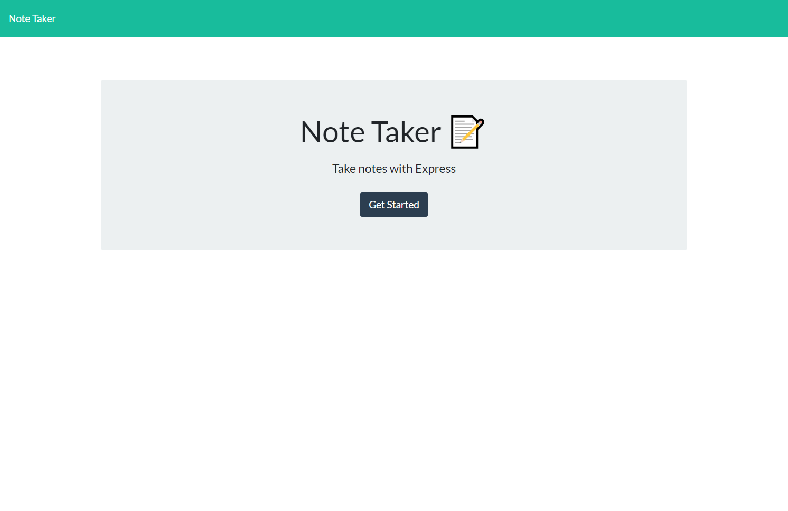
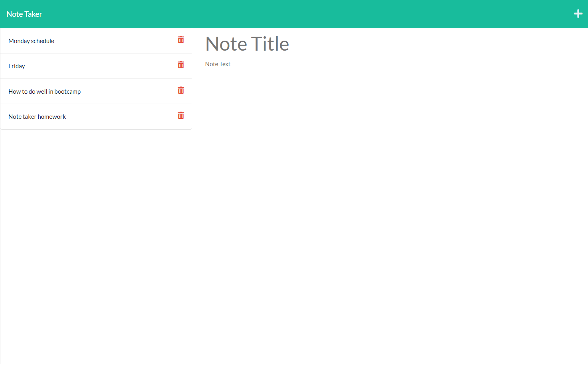

# Note Taker

## Table of contents

- [Overview](#overview)
  - [The challenge](#the-challenge)
  - [User Story](#user-story)
  - [Acceptance Criteria](#acceptance-criteria)
  - [Screenshot](#screenshot)
  - [Links](#links)
- [My process](#my-process)
  - [Built with](#built-with)
  - [What I learned](#what-i-learned)
  - [Continued development](#continued-development)
  - [Useful resources](#useful-resources)
- [Author](#author)

## Overview

### The challenge

Creat an application that can write and save notes using express as the back end. 

### User Story

```
AS A small business owner
I WANT to be able to write and save notes
SO THAT I can organize my thoughts and keep track of tasks I need to complete
```

### Acceptance Criteria

```
GIVEN a note-taking application
WHEN I open the Note Taker
THEN I am presented with a landing page with a link to a notes page
WHEN I click on the link to the notes page
THEN I am presented with a page with existing notes listed in the left-hand column, plus empty fields to enter a new note title and the note’s text in the right-hand column
WHEN I enter a new note title and the note’s text
THEN a Save icon appears in the navigation at the top of the page
WHEN I click on the Save icon
THEN the new note I have entered is saved and appears in the left-hand column with the other existing notes
WHEN I click on an existing note in the list in the left-hand column
THEN that note appears in the right-hand column
WHEN I click on the Write icon in the navigation at the top of the page
THEN I am presented with empty fields to enter a new note title and the note’s text in the right-hand column
```

### Screenshot





### Links

- Recording: [Watch this please](https://drive.google.com/file/d/17sWi95yyxKHMoMoYvbLVlAnNORMOF1uP/view?usp=sharing)


## My process

### Built with

- Javascript
- NPM:
  - Express
  - FS

### What I learned

I learned how to set up a server and store information in a local database. I know how to set up folders to make path to a directory. It was initially confusing but to differentiate GET and POST between the front and back end. 

### Continued development

Since the framework of the front end was already made, I was able to focus on setting up the back end.I would like to create this note taker app from scratch including the front end. Several of the code for the back end were copied from class work, so I would also like to make this without looking at any references. 

### Useful resources

Resources below helped me understand more why we need specific parts of the server. For example, why we need a middle wear and to json and parse the data. The documentation of express helped me learn other functions. Postman was helpful showing if my server was active. 

- [1](https://stackoverflow.com/questions/23259168/what-are-express-json-and-express-urlencoded)
- [2](https://www.geeksforgeeks.org/express-js-express-json-function/)
- [3](https://expressjs.com/)
- [4](https://web.postman.co/)


## Author

- Website - [Adriane Ocampo](https://ocampoad.github.io/Adriane_Ocampo_Portfolio/)